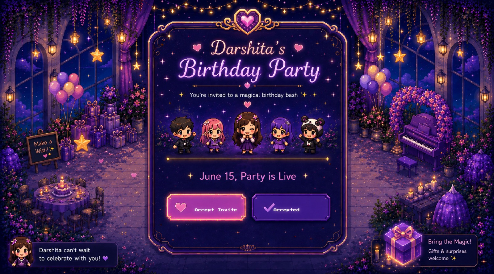
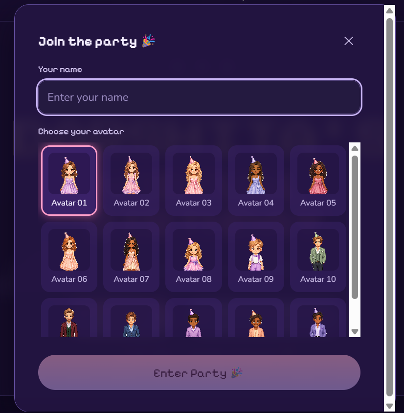
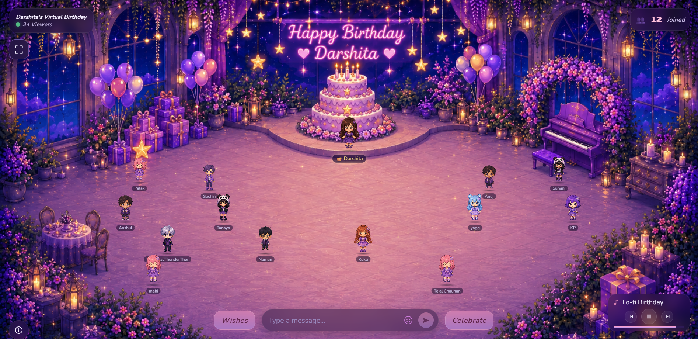
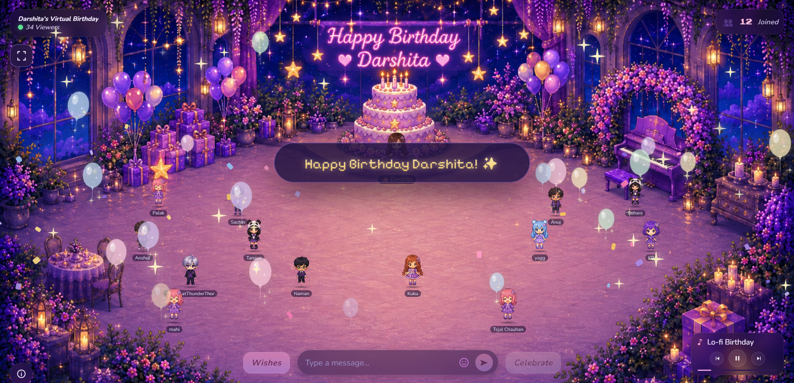
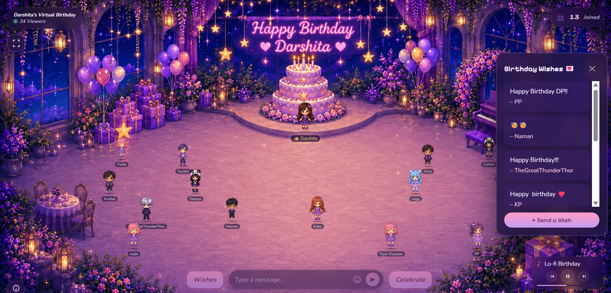
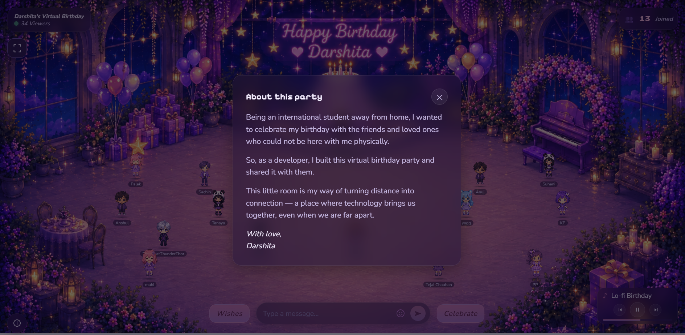

# Virtual Birthday Party — Multiplayer Memory Capsule 🎂

A real-time virtual birthday party web app where friends and family can open a shared link, accept the invitation, choose an avatar, join the party room, appear with their name tag, leave birthday wishes, and become part of a shared memory capsule.

🌐 **Live Demo:** https://virtual-birthday-party-mu.vercel.app

---

## Demo


---

## Why I Built This

Being an international student away from home, I wanted to celebrate my birthday with the friends and loved ones who could not be here with me physically.

So, as a developer, I built this virtual birthday party and shared it with them.

This little room is my way of turning distance into connection — a place where technology brings us together, even when we are far apart.

---
## Preview

| Invitation | RSVP and Avatar Selection | Multiplayer Party Room |
|---|---|---|
|  |  |  |

| Celebration Moment | Shared Wishes | About This Party |
|---|---|---|
|  |  |  |

---

## Features

- Interactive birthday invitation landing page
- RSVP flow with name entry and avatar selection
- Shared multiplayer party room
- Real-time guest presence powered by Supabase
- Persistent guest avatars and name tags
- Shared birthday wishes
- Realtime wish updates
- Viewer and joined counters
- Music player with multiple tracks
- Celebrate button with confetti, balloons, sparkles, and shimmer effects
- About This Party modal explaining the personal story behind the project
- Mobile landscape game-style experience
- Portrait mobile rotate prompt
- Responsive desktop and mobile layouts
- Vercel production deployment

---

## Technical Highlights

- Built a real-time multiplayer guest system using Supabase, where each visitor can join with a name and avatar and appear in the shared party room
- Designed a slot-based placement system to reduce avatar collisions and keep guests positioned naturally in the room
- Used Supabase Row Level Security with public anon access for a private invite-based experience, allowing guests and wishes while preventing deletes
- Implemented shared birthday wishes with persistent storage and realtime updates across browsers
- Created a mobile landscape game mode with a CSS-only rotate prompt instead of relying on unreliable device-orientation locking
- Added a responsive camera system for desktop and mobile so the room can open focused or wide depending on device context
- Optimized public assets by removing unused files and moving backup design assets out of the deployed public folder

---

## Tech Stack

- **Frontend:** Next.js, React, TypeScript
- **Styling:** CSS Modules, CSS custom properties
- **Backend / Realtime:** Supabase
- **Deployment:** Vercel
- **State:** LocalStorage + Supabase
- **Tooling:** pnpm, Turborepo, ESLint, Prettier

---

## Project Structure

```text
├── birthday/
│   ├── apps/
│   │   └── web/                  # Next.js app
│   ├── supabase/
│   │   └── migrations/           # Supabase database schema
│   ├── packages/                 # Shared workspace packages
│   ├── docs/                     # Documentation and screenshots
│   └── scripts/                  # Utility scripts
└── README.md                     # This file
```

---

## Supabase Database

The app uses Supabase for the shared memory capsule.

### Tables

- `party_guests` — joined guests, avatar choices, and room positions
- `party_wishes` — birthday wishes from visitors
- `party_events` — viewer and invite interaction events

The migration file is located at:

```text
birthday/supabase/migrations/
```

---

## Environment Variables

Create this file locally:

```text
birthday/apps/web/.env.local
```

Add:

```env
NEXT_PUBLIC_SUPABASE_URL=your_supabase_project_url
NEXT_PUBLIC_SUPABASE_ANON_KEY=your_supabase_anon_or_publishable_key
```

Do not commit `.env.local`.

---

## Run Locally

```bash
git clone https://github.com/Darshita-dp/virtual-birthday-party.git
cd virtual-birthday-party/birthday
pnpm install
pnpm dev
```

Then open:

```text
http://localhost:3000
```

---

## Build Checks

```bash
cd birthday
pnpm lint
pnpm typecheck
pnpm build
```

---

## Deployment

The project is deployed on Vercel.

For this repository structure, the Vercel project uses:

```text
Root Directory: birthday/apps/web
Framework: Next.js
```

The following environment variables must also be added in Vercel:

```env
NEXT_PUBLIC_SUPABASE_URL
NEXT_PUBLIC_SUPABASE_ANON_KEY
```

---

## Status

Launched as a personal creative project and shared with friends and family as a virtual birthday memory capsule.

Built with love by **Darshita Patel**.
